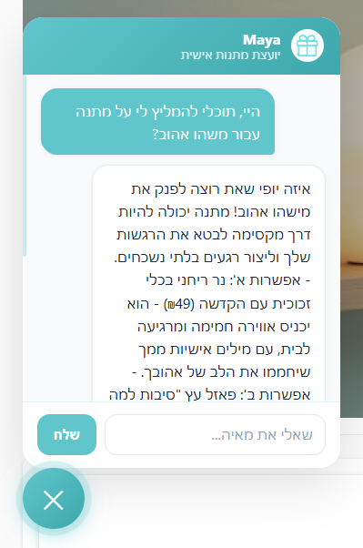

# AI Chat & Semantic Search — GiftForU

## סקירה כללית

פיצ'ר AI שמוסיף לאתר GiftForU שני יכולות:
1. **Maya** — סוכן צ'אט חכם שמייעץ על מתנות בשפה טבעית
2. **חיפוש סמנטי** — חיפוש מוצרים לפי משמעות, לא רק מילות מפתח

---
[לחצו כאן לצפייה בהקלטת המסך של הצאט](https://drive.google.com/file/d/1VTlNAwokN07vQtGwbZm-rFP3g_4S2E6j/view?usp=sharing)


---
## ארכיטקטורה

```
Angular  →  .NET (proxy)  →  Python (FastAPI)  →  OpenAI
```

- **Angular** — ממשק המשתמש (צ'אט widget + שורת חיפוש)
- **.NET** — proxy מאובטח שמחזיק את מפתח ה-API ושולף מוצרים מה-DB
- **Python (FastAPI)** — כל לוגיקת ה-AI: צ'אט, embeddings, חיפוש סמנטי
- **OpenAI** — GPT-4o-mini לצ'אט, text-embedding-3-large לחיפוש

---

## הרצה מקומית

### דרישות מוקדמות
- Python 3.10+
- .NET 9
- Angular 21
- חשבון OpenAI עם קרדיט

### 1. Python Service

```bash
cd ai_service
pip install -r requirements.txt
```

צור קובץ `.env` בתיקיית `ai_service`:
```
OPENAI_API_KEY=sk-proj-...
STORE_NAME=GiftForU
STORE_DESCRIPTION=An online store selling personalized and unique gifts.
```

הפעל:
```bash
uvicorn chat_service:app --port 8001 --reload
```

### 2. .NET Backend

```bash
cd backend/WebAPIShop
dotnet run
```

> בעליית ה-.NET הוא שולח את כל המוצרים ל-Python לבניית embeddings cache.  
> **חשוב:** Python חייב לרוץ לפני ה-.NET.

### 3. Angular Frontend

```bash
cd frontend
npm install
ng serve
```

---

## Maya — סוכן הצ'אט

### איך זה עובד
1. המשתמש כותב הודעה בצ'אט
2. Angular שולח את ההודעה + היסטוריית השיחה ל-`.NET /api/chat`
3. .NET שולף את רשימת המוצרים מה-DB (עם cache סטטי — שליפה פעם אחת)
4. .NET מעביר הכל ל-Python
5. Python בונה prompt עם קטלוג המוצרים ושולח ל-GPT-4o-mini
6. התשובה חוזרת ל-Angular ומוצגת

### System Prompt — Maya
Maya היא יועצת מתנות אישית עם אישיות חמה ואמפתית. הכללים העיקריים:
- עונה בשפת המשתמש (עברית/אנגלית)
- ממליצה **רק** ממוצרים קיימים ברשימה
- מציעה תמיד **בדיוק 2 אפשרויות**
- מסיימת כל תשובה בשאלת המשך אחת
- שואלת לפני כל ניווט לעמוד

### ניווט חכם
Maya יכולה לנווט המשתמש לעמודים באתר אחרי אישור:
- `/products` — עמוד המוצרים
- `/connect-us` — צור קשר
- `/about` — אודות
- `/cart` — עגלת קניות
- `/products?q=שם מוצר` — חיפוש מוצר ספציפי

הניווט מתבצע דרך tag מיוחד: `[NAVIGATE:/route]`

---

## חיפוש סמנטי

### מה זה Embedding?
Embedding הוא רשימת מספרים (~3072 מספרים עם text-embedding-3-large) שמייצגת את **המשמעות** של טקסט. טקסטים דומים במשמעות מקבלים וקטורים קרובים.

```
"חלוק רחצה מפנק"  →  [0.12, -0.87, 0.34, ...]
"משהו חמים לחורף"  →  [0.14, -0.81, 0.39, ...]  ← קרוב! score ~0.4
"עט מתכת יוקרתי"   →  [-0.92, 0.03, -0.61, ...] ← רחוק, score ~0.2
```

### איך זה עובד

#### בעליית השרת (פעם אחת):
1. .NET שולח את כל המוצרים ל-`/cache-products`
2. Python מחשב embedding לכל מוצר (שם + תיאור) ושומר ב-dictionary בזיכרון

#### בכל חיפוש:
1. Python מחשב embedding לשאילתת המשתמש
2. משווה את ה-embedding של השאילתה לכל מוצר בה-cache (cosine similarity)
3. מחזיר רק תוצאות עם score ≥ 0.32
4. ממוין לפי ציון — הכי רלוונטי ראשון

### Cosine Similarity
הנוסחה שמודדת קרבה בין שני וקטורים:
```
score = dot(a, b) / (norm(a) * norm(b))
```
- `1.0` = זהה לחלוטין
- `0.0` = לא קשור
- סף רלוונטיות: `0.32`

### לוגיקת החיפוש בפרונט
1. משתמש מקיש Enter בשדה החיפוש
2. קודם — חיפוש רגיל לפי שם (client-side, מיידי)
3. אם אין תוצאות → חיפוש סמנטי ל-`/api/search`
4. אם גם סמנטי לא מצא מעל סף → "לא נמצאו מוצרים"

---

## קבצים עיקריים

| קובץ | תיאור |
|------|-------|
| `ai_service/chat_service.py` | כל לוגיקת ה-AI: צ'אט, embeddings, חיפוש |
| `ai_service/.env` | מפתח OpenAI (לא מועלה ל-Git) |
| `backend/WebAPIShop/Controllers/ChatController.cs` | proxy לצ'אט עם cache מוצרים |
| `backend/WebAPIShop/Controllers/SearchController.cs` | endpoint לחיפוש סמנטי |
| `frontend/src/app/components/chat/` | צ'אט widget (Maya) |
| `frontend/src/app/services/chat.service.ts` | קריאות HTTP לצ'אט ולחיפוש |
| `frontend/src/app/services/search-state.service.ts` | state משותף לחיפוש בין Header ל-products-page |

---

## אבטחה

- מפתח OpenAI נמצא **רק** ב-`ai_service/.env`
- `.env` רשום ב-`.gitignore`
- ה-.NET משמש כ-proxy — Angular לא נוגע במפתח
- CORS מוגדר ל-`*` בפיתוח — **יש להגביל לדומיין לפני production**

---

## לפני העלייה לאוויר

1. החלף `allow_origins=['*']` ב-`chat_service.py` בדומיין האמיתי
2. החלף `WithOrigins("http://localhost:4200")` ב-`Program.cs` בדומיין האמיתי
3. ודא שה-`.env` לא מועלה ל-Git
4. שקול להגדיל את מגבלת המוצרים ב-`ChatController` אם הקטלוג גדל

---


<hr style="border: 5px solid #3ce5e5; margin: 30px 0;">


## Real-Time Emotion Mirror — מראה רגשות בזמן אמת
[לחצו כאן לצפייה בהקלטת המסך של הצאט](https://drive.google.com/file/d/1px6aYUns8zoLFKiQP517BOBcrUSKOgWs/view?usp=sharing)


---
### איך זה עובד
1. **לכידה מהירה (Debounce & Cooldown):** המשתמש מפעיל את המצלמה דרך ה-chat widget. כדי להעניק פידבק מיידי, מבוצע צילום פריים (`snapshot`) מהיר כבר בלחיצת המקש הראשונה (`keydown`) בשילוב זמן השהייה (`cooldown` של 800ms) למניעת כפילויות. בהמשך ההקלדה הרציפה, המערכת מפעילה מנגנון `debounce` של שנייה אחת כדי לשמור על ביצועים.
2. **זרימת המידע:** ה-Frontend לוכד את הפריים (Base64) מזרם הווידאו (הממתין לווידאו שיהיה מוכן לחלוטין) ושולח אותו ל-`.NET proxy` בכתובת `/api/chat/analyze-emotion`.
3. **תיוג וניתוח רגשות:** ה-`.NET` מעביר את התמונה לשירות ה-Python (FastAPI). השרת מפעיל את ספריית `DeepFace` בתוך תהליכון נפרד (`asyncio.to_thread`) כדי לא לחסום את ה-Event Loop של האפליקציה, ומחזיר את הרגש הדומיננטי שזוהה מנורמל לאותיות קטנות (`lowercase`).
4. **סנכרון ויזואלי דינמי:** ה-Frontend מעדכן את ממשק המשתמש בזמן אמת (`in-place update`) לפי הרגש שחזר:
   - **אימוג'י:** האייקון המוצע בראש הצ'אט מתחלף ומתאים את עצמו במדויק לרגש הנוכחי (למשל, Happy מציג 😊). לחיצה על מקש `TAB` תשלב אותו ישירות בתיבת הטקסט.
   - **צבע רקע דינמי:** צבע הרקע של תיבת הטקסט (`textarea`) משתנה ומקבל את הגוון הייחודי שמאפיין את הרגש (`EMOTION_COLORS`).
   - **גרף מדרגתי:** היסטוריית ומגמת הרגשות מתועדות לאורך ציר הזמן על גבי גרף קו מדרגתי יחיד (`stepped line`) ללא ריצודים.

### נקודות קצה (Endpoints)
- `POST /api/chat/analyze-emotion` — נקודת הקצה ב-`.NET proxy` שמקבלת את ה-Base64 של התמונה ומנתבת אותו אל ה-AI Service.
- `POST /analyze-emotion` — נקודת הקצה ב-Python (FastAPI) שמפעילה את `DeepFace.analyze` ומחזירה את תוצאות הרגש והציונים.

* * *
